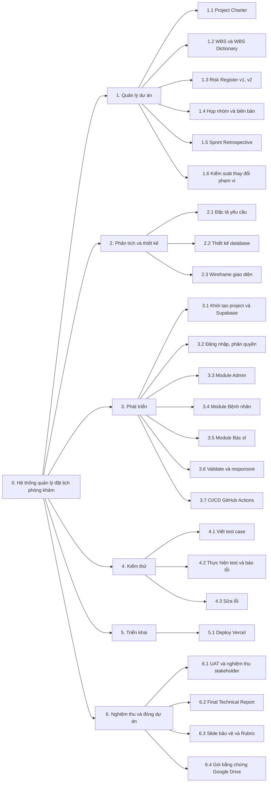

# WBS — Hệ thống quản lý đặt lịch phòng khám

```mermaid
flowchart LR
  A0["0. Hệ thống quản lý đặt lịch phòng khám"]
  A0 --> A1["1. Quản lý dự án"]
  A0 --> A2["2. Phân tích và thiết kế"]
  A0 --> A3["3. Phát triển"]
  A0 --> A4["4. Kiểm thử"]
  A0 --> A5["5. Triển khai"]
  A0 --> A6["6. Nghiệm thu và đóng dự án"]
  A1 --> A11["1.1 Project Charter"]
  A1 --> A12["1.2 WBS và WBS Dictionary"]
  A1 --> A13["1.3 Risk Register v1, v2"]
  A1 --> A14["1.4 Họp nhóm và biên bản"]
  A1 --> A15["1.5 Sprint Retrospective"]
  A1 --> A16["1.6 Kiểm soát thay đổi phạm vi"]
  A2 --> A21["2.1 Đặc tả yêu cầu"]
  A2 --> A22["2.2 Thiết kế database"]
  A2 --> A23["2.3 Wireframe giao diện"]
  A3 --> A31["3.1 Khởi tạo project và Supabase"]
  A3 --> A32["3.2 Đăng nhập, phân quyền"]
  A3 --> A33["3.3 Module Admin"]
  A3 --> A34["3.4 Module Bệnh nhân"]
  A3 --> A35["3.5 Module Bác sĩ"]
  A3 --> A36["3.6 Validate và responsive"]
  A3 --> A37["3.7 CI/CD GitHub Actions"]
  A4 --> A41["4.1 Viết test case"]
  A4 --> A42["4.2 Thực hiện test và báo lỗi"]
  A4 --> A43["4.3 Sửa lỗi"]
  A5 --> A51["5.1 Deploy Vercel"]
  A6 --> A61["6.1 UAT và nghiệm thu stakeholder"]
  A6 --> A62["6.2 Final Technical Report"]
  A6 --> A63["6.3 Slide bảo vệ và Rubric"]
  A6 --> A64["6.4 Gói bằng chứng Google Drive"]
```